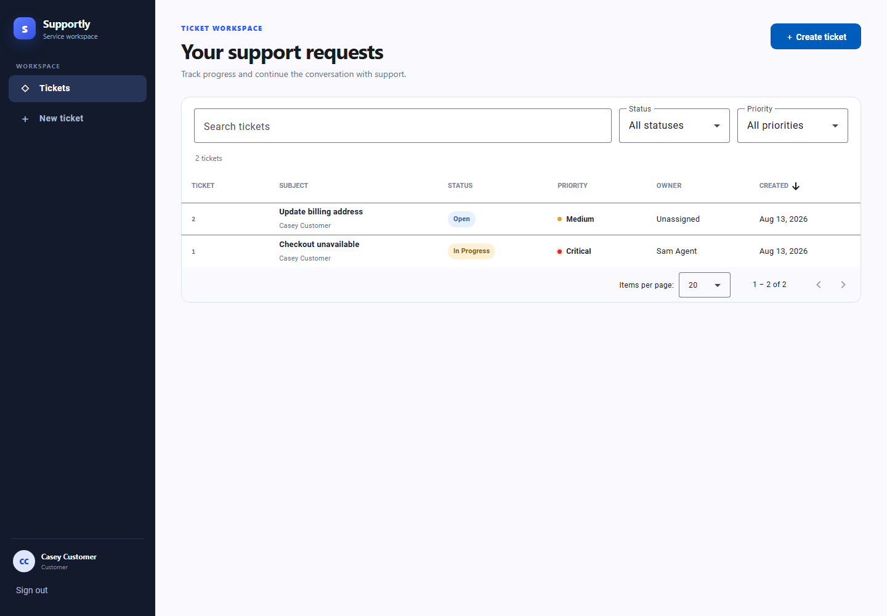
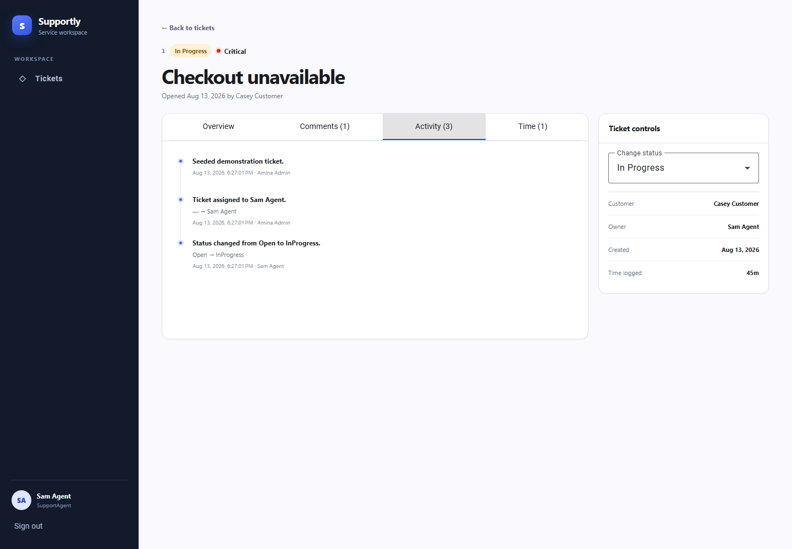
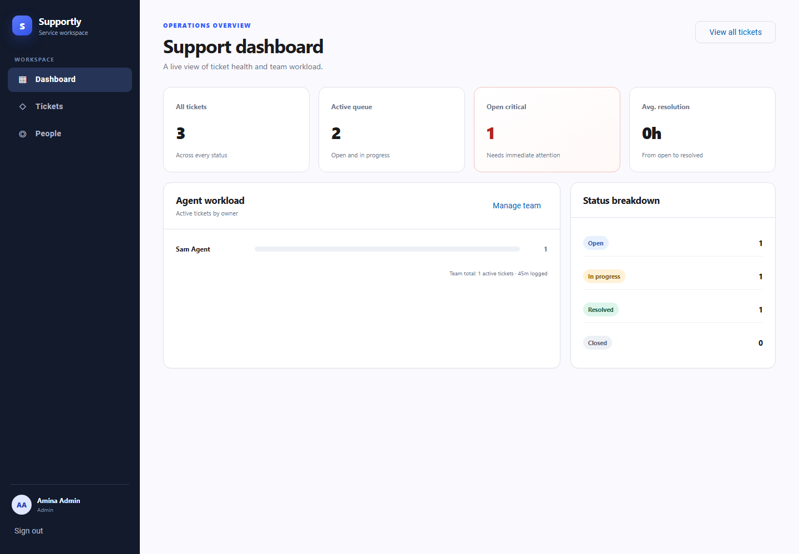
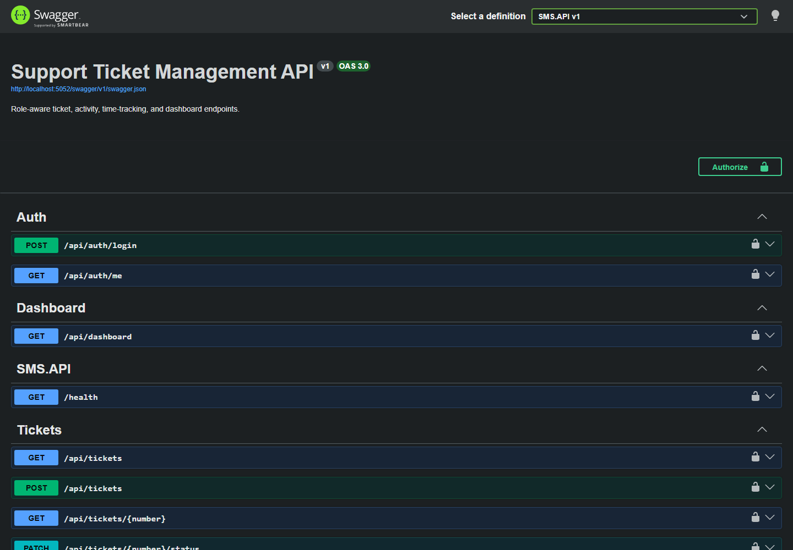

# Support Ticket Management System

A role-aware support desk for creating, assigning, tracking, and resolving customer tickets. The application uses ASP.NET Core Web API, Entity Framework Core with SQL Server, JWT bearer authentication, and an Angular/Material client.

Repository: [github.com/AhmedOsmanDev/SupportManagementSystem](https://github.com/AhmedOsmanDev/SupportManagementSystem)

> **Assessment status:** implementation is intended as a focused 12–16 hour technical assessment. See [Assumptions and known limitations](#assumptions-and-known-limitations) for the explicit scope boundary. Runtime screenshots and a repeatable capture script are included under [`docs/`](docs/); the hosted repository URL is supplied in the submission message.

## What is included

- Admin, support-agent, and customer roles with server-side authorization
- Strict customer ticket ownership checks (list and resource-level operations)
- Ticket pagination, filtering, search, sorting, assignment, priority changes, and validated status transitions
- Comments plus an immutable activity timeline for ticket changes
- Agent time entries and calculated total work time per ticket
- Dashboard metrics and a chart for operational visibility
- Central API error handling, validation, structured logging, DTO boundaries, migrations, and deterministic seed data
- Fixed-window API rate limiting and SQL Server row-version optimistic concurrency handling
- Backend unit, API integration, customer-isolation, and frontend unit tests
- Swagger/OpenAPI, a Postman collection, standalone Docker images/runner, and GitHub Actions CI

## Technology

| Area | Technology |
| --- | --- |
| API | ASP.NET Core Web API on .NET 10 (satisfies .NET 8+) |
| Persistence | Entity Framework Core 10 and SQL Server 2022 |
| Security | JWT bearer authentication and role/ownership authorization |
| API documentation | Swagger / OpenAPI |
| Client | Angular 21 (satisfies Angular 17+), TypeScript, RxJS, Reactive Forms, Angular Material |
| Tests | xUnit, `WebApplicationFactory`, EF Core InMemory, FluentAssertions, Vitest |

## Architecture

The backend follows Clean Architecture with dependencies pointing toward the core:

```text
SMS.API ───────────► SMS.Application ───────────► SMS.Domain
   │                        ▲
   └──────────────► SMS.Infrastructure ─────────► SMS.Domain
                            │
                            └───────────────────► SMS.Application
```

| Project | Responsibility | Project dependencies |
| --- | --- | --- |
| `SMS.Domain` | Entities, enums, and business invariants | None |
| `SMS.Application` | Use-case contracts, request/response models, validation errors, and shared abstractions | `SMS.Domain` |
| `SMS.Infrastructure` | EF Core, SQL Server, seeding, numbering, and service implementations | `SMS.Application`, `SMS.Domain` |
| `SMS.API` | Controllers, JWT/HTTP adapters, middleware, OpenAPI, and dependency composition | `SMS.Application`, `SMS.Infrastructure` |

The source folders mirror those responsibilities:

```text
src/
├── SMS.Domain/
│   ├── Entities/
│   └── Enums/
├── SMS.Application/
│   ├── Common/
│   │   ├── Abstractions/
│   │   ├── Exceptions/
│   │   └── Models/
│   └── Features/
│       ├── Authentication/
│       ├── Dashboard/
│       ├── Tickets/
│       └── Users/
├── SMS.Infrastructure/
│   ├── Authentication/
│   ├── Persistence/
│   │   ├── Configurations/
│   │   ├── Initialization/
│   │   ├── Migrations/
│   │   └── Numbering/
│   └── Services/
│       ├── Dashboard/
│       ├── Tickets/
│       └── Users/
└── SMS.API/
    ├── Authentication/
    ├── Controllers/
    ├── Middleware/
    └── Persistence/DesignTime/
```

Each handwritten application type has its own file. EF-backed implementations remain in Infrastructure so Application stays independent of EF Core, while API consumes only Application-facing contracts and Infrastructure registration—never Domain entities directly. API responses use DTOs rather than exposing EF entities. The Angular application groups features behind lazy routes, while guards and the authentication interceptor handle client-side access and bearer tokens. Server authorization remains authoritative—route guards are usability controls, not a security boundary.

## Prerequisites

Choose either Docker or local tooling.

### Docker path

- Docker Engine / Docker Desktop
- A POSIX shell (`sh` through Git Bash, WSL, Linux, or macOS) for `docker.sh`
- At least 4 GB available memory for SQL Server

### Local path

- .NET SDK 10.x
- Node.js 24.x and npm
- SQL Server 2022 (Developer, Express, LocalDB, or a container)
- Optional: EF CLI, installed with `dotnet tool install --global dotnet-ef --version 10.*`

## Quick start with Docker

1. Copy the example environment file and replace both development-only values:

   ```powershell
   Copy-Item .env.example .env
   ```

   ```bash
   cp .env.example .env
   ```

2. Build the API/web images and start SQL Server, the API, and the web client with plain Docker commands:

   ```bash
   sh ./docker.sh up
   ```

3. Open:

   - Web application: <http://localhost:4200>
   - Swagger UI: <http://localhost:5052/swagger>
   - OpenAPI JSON: <http://localhost:5052/swagger/v1/swagger.json>

4. Manage the stack with:

   ```bash
   sh ./docker.sh status
   sh ./docker.sh logs api   # api, web, or sql
   sh ./docker.sh down       # preserves SQL data
   sh ./docker.sh reset      # permanently deletes SQL data and reseeds
   ```

`docker.sh build` builds `support-management-api:local` and `support-management-web:local` without requiring `.env`; CI uses this command to validate both Dockerfiles. The runner binds its ports to localhost only and stores SQL data in the `sms-sql-data` volume. A persisted SQL volume keeps the password used when it was created, so changing `MSSQL_SA_PASSWORD` later requires the original value or an explicit `reset`.

## Local setup

### 1. Configure secrets

The repository contains no production secrets. Configure a local SQL connection and JWT signing key with .NET user secrets:

```bash
dotnet user-secrets set "ConnectionStrings:DefaultConnection" 'Server=localhost;Database=SMS;User=sa;Password=P@$$w0rd;Encrypt=True;TrustServerCertificate=True;' --project src/SMS.API
dotnet user-secrets set "Jwt:Secret" "replace-with-a-random-secret-at-least-32-characters-long" --project src/SMS.API
```

For SQL authentication, change only the connection string and keep the password in user secrets or an environment variable—not in `appsettings*.json`.

### 2. Restore and migrate the database

```bash
dotnet restore SupportManagementSystem.slnx
dotnet ef database update --project src/SMS.Infrastructure --startup-project src/SMS.API
```

The migration creates the schema. Run the API once after migrating; startup idempotently adds the seeded demonstration users and sample tickets when they are missing.

### 3. Run the API

```bash
dotnet run --project src/SMS.API --launch-profile http
```

The local API listens on <http://localhost:5052>. Swagger is available in the Development environment.

### 4. Run the Angular client

In a second terminal:

```bash
cd client/sms-angular
npm ci
npm start
```

Open <http://localhost:4200>.

## Seeded demonstration accounts

All accounts below are synthetic development/test identities. Change or remove the seed passwords before using the application outside a local assessment environment.

The application has two development-only database flags in `src/SMS.API/appsettings.Development.json`: schema migration and demo seeding are enabled there for reviewer convenience. Base/production settings disable both, and startup rejects demo seeding outside Development or Testing.

<!-- SEED_ACCOUNTS_START -->

| Role | Email | Password |
| --- | --- | --- |
| Admin | `admin@support.local` | `Admin123!` |
| Support agent | `agent@support.local` | `Agent123!` |
| Customer 1 | `customer@support.local` | `Customer123!` |
| Customer 2 (isolation checks) | `customer2@support.local` | `Customer123!` |

<!-- SEED_ACCOUNTS_END -->

The second customer lets reviewers verify that changing a ticket number in the URL or API request never exposes another customer's ticket. Automated isolation tests additionally create unique users to avoid shared mutable test state.

## API usage

Swagger describes the authoritative request and response schemas. A ready-to-run collection is provided at [`docs/postman/SupportManagementSystem.postman_collection.json`](docs/postman/SupportManagementSystem.postman_collection.json). Import it into Postman, select the collection, and run the **Login** requests; test scripts store role tokens and newly created ticket numbers as collection variables.

General flow:

1. `POST /api/auth/login` returns a JWT and user profile.
2. Click **Authorize** in Swagger and enter the raw access token. Swagger adds the `Bearer` prefix (or let the Postman login tests save it).
3. Call tickets, comments, time entries, users, or dashboard endpoints allowed for that role.

Security-sensitive behavior intentionally returns `404 Not Found` when a customer requests another customer's ticket. This avoids confirming whether the foreign resource exists. An absent/invalid token returns `401 Unauthorized`; an authenticated role lacking permission for a non-ownership operation returns `403 Forbidden`.

## Tests

Run the complete backend suite:

```bash
dotnet test SupportManagementSystem.slnx
```

Or run suites independently:

```bash
dotnet test tests/SMS.UnitTests/SMS.UnitTests.csproj
dotnet test tests/SMS.IntegrationTests/SMS.IntegrationTests.csproj
dotnet test tests/SMS.DataIsolationTests/SMS.DataIsolationTests.csproj
```

The API integration and data-isolation fixtures replace SQL Server with a unique EF Core in-memory database per test factory. They do not require Docker or a shared developer database. Coverage can be collected with:

```bash
dotnet test SupportManagementSystem.slnx --collect:"XPlat Code Coverage" --results-directory TestResults
```

Run frontend tests and the production build:

```bash
cd client/sms-angular
npm ci
npm test -- --watch=false
npm run build
```

CI runs backend restore/build/tests, frontend tests/build, uploads backend test results, and validates both container builds. See [`.github/workflows/ci.yml`](.github/workflows/ci.yml).

Latest local verification: 66 backend tests passed (30 unit, 26 integration, 10 isolation), 11 frontend tests passed, and the Release/API and Angular production builds completed without warnings or errors. EF reported no pending model changes, and the integer ticket migration was verified against SQL Server LocalDB in both directions while preserving related data. Docker was unavailable on the verification machine, so container image builds are delegated to CI.

## Database migrations

Migrations live in `src/SMS.Infrastructure/Persistence/Migrations`. After an intentional model change, create and review a migration:

EF commands use the API project's design-time `ApplicationDbContextFactory`, so they require only `ConnectionStrings:DefaultConnection`; the JWT signing secret is required when running the API, not when generating migrations.

```bash
dotnet ef migrations add MeaningfulMigrationName --project src/SMS.Infrastructure --startup-project src/SMS.API
dotnet ef database update --project src/SMS.Infrastructure --startup-project src/SMS.API
```

Never edit an already-applied production migration. Generate a follow-up migration instead.

`ConvertTicketNumbersToIntegers` converts the former numeric strings to integers without renumbering them (`00003` becomes `3`). Related comments, activities, and time entries are converted in the same transaction and keep their relationships. The migration also widens the SQL Server sequence from the former five-digit range to the full positive `int` range.

## Configuration and security notes

- Configuration is loaded through ASP.NET Core configuration providers. Environment variables use double underscores, for example `ConnectionStrings__DefaultConnection` and `Jwt__Secret`.
- `Database:MigrateOnStartup` and `Database:SeedDemoData` are enabled only by the tracked Development settings. Both default to `false` in the base settings; production deployments should run reviewed migrations as a deployment step and must never enable the known demo credentials. The API refuses demo seeding outside Development or Testing.
- JWT signing secrets and database passwords are intentionally absent from tracked settings. `.env` is gitignored; `.env.example` contains replaceable local examples only.
- Customer identity is taken from the validated JWT, never from a customer ID supplied by the request body or query string.
- List queries are ownership-scoped before paging. Detail, comment, close, and related-resource operations repeat the resource-level ownership check to prevent IDOR attacks.
- Passwords are stored as one-way hashes. Seed plaintext passwords exist only as documented local demonstration credentials.
- API DTOs prevent over-posting and EF entity leakage. Validation errors use standard problem details.

## Assessment deliverables

| Deliverable | Location / status |
| --- | --- |
| Full source and clean history | This repository; add the hosted repository URL in the submission message |
| EF migrations and seed users | `src/SMS.Infrastructure/Persistence/Migrations` and seed configuration |
| Setup, credentials, tests, architecture, scope | This README |
| OpenAPI | `/swagger` and `/swagger/v1/swagger.json` while the API runs |
| Postman | `docs/postman/SupportManagementSystem.postman_collection.json` |
| Screenshots or video | Seven runtime screenshots in `docs/screenshots/`; repeatable capture script in `scripts/capture-screenshots.ps1` |
| Docker and CI bonus | `docker/api.Dockerfile`, `docker/web.Dockerfile`, `docker.sh`, and `.github/workflows/ci.yml` |

## Assumptions and known limitations

### Assumptions

- A ticket number is an immutable, auto-generated positive integer such as `3` or `16`.
- Customers may create tickets, comment on their own tickets, and close their own tickets only after they are Resolved.
- Support agents operate only on tickets assigned to them; admins can see and manage all tickets.
- Only admins assign agents or change priority. Agents may progress assigned-ticket status and log their own time.
- Durations are stored as positive whole minutes; total time is the sum of accepted entries.
- Resolution time is measured from creation to the first/current resolved timestamp and summarized across resolved/closed tickets.
- Dates are stored and returned in UTC; the browser renders them in the viewer's local timezone.
- Pagination is one-based and bounded by the API to protect the database from unbounded requests.

### Known limitations

- No email, SMS, file attachment, SLA/escalation, or external identity-provider integration is included.
- Access tokens are the implemented session mechanism; optional refresh-token rotation was not implemented.
- SignalR live updates and application-level caching were not implemented. Standalone Docker images, optimistic concurrency, rate limiting, and CI are included from the optional bonus list.
- The activity timeline is application-enforced audit history, not a compliance-grade immutable audit store.
- Dashboard aggregation is computed on demand and is suitable for assessment-scale data; a production deployment may add caching/read models.
- The standalone Docker runner is for local development, not a hardened production topology. Environment values remain visible to local Docker administrators; production deployments must supply managed secrets, TLS termination, backups, and observability.
- SQL Server is the supported persistent provider. In-memory EF is used only by isolated automated tests and may not reproduce every relational edge case.
- Publishing or updating the hosted Git repository remains an explicit submitter action; the repository includes locally captured UI/Swagger screenshots and a reproducible capture script.

## Demonstration

Follow [`docs/demo-script.md`](docs/demo-script.md) for a concise reviewer walkthrough. Screenshot names and redaction guidance are in [`docs/screenshots/README.md`](docs/screenshots/README.md).

| Customer ticket workspace | Ticket activity timeline |
| --- | --- |
| [](docs/screenshots/02-customer-ticket-list.png) | [](docs/screenshots/04-ticket-timeline-and-time.png) |

| Admin dashboard | Swagger / OpenAPI |
| --- | --- |
| [](docs/screenshots/05-admin-dashboard.png) | [](docs/screenshots/07-swagger.png) |
